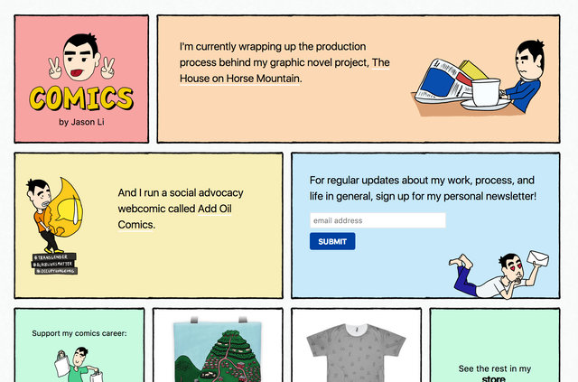
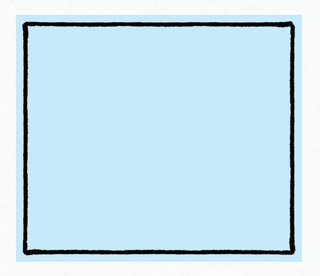
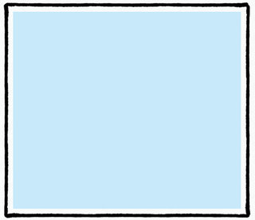
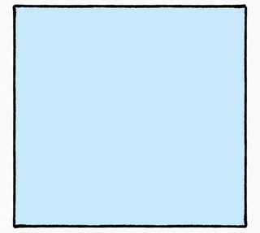
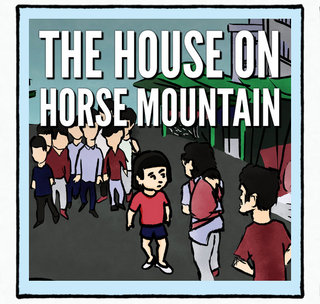
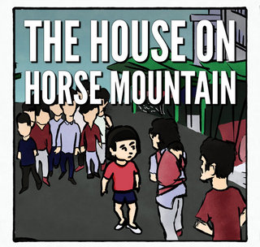
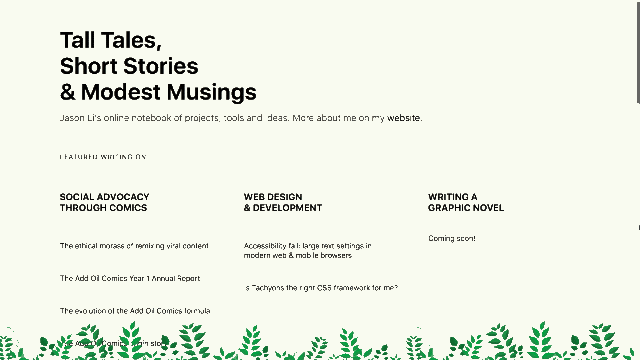

# illustration.css

Front-end design patterns for adding illustrations onto websites. A work in progress.

---

## border image

Hard, square edges on <div>s and boxes are boring – why not spruce up your layouts with some illustrated borders? Check out [CSS Tricks' primer on the border-image CSS property](https://css-tricks.com/understanding-border-image/).

### Case study: hand-drawn black border

Example:[Comics by Jason Li](http://comics.hongkonggong.com):



TL;DR – it's difficult to simultaneously create a rough, organic edge *and* control the color of the enclosed box. 

Take this border image I made for [my comics site](http://comics.hongkonggong.com) (it has a transparent background):


Without fidgeting, if I applied these background and border-image properties:

```
background-color: #C8E9F9;
border-width: 1rem;
border-image-source: url('assets/BorderImage.png');
border-image-slice: 5% fill;
border-image-width: 1rem;
border-image-repeat: round;
```

Then I'd get:



So I add a `border-image-outset: 1rem;` to push the border out:



But this leaves big white borders around the edges. I then fidget with the values – by trial and error – so the blue and the black line butt up against one another nicely, and my black line is a nice-looking width:

```
background-color: #C8E9F9;
border-width: 0.67rem;
border-image-source: url('assets/BorderImage.png');
border-image-slice: 4% 4.5% fill;
border-image-width: 0.67rem;
border-image-outset: 0.45rem 0.35rem;
border-image-repeat: round;
```



This works unless I need to stick in a photo to be fully-flush with the black border.



In that case, I manually adjust the border-image-outset till it crops right to the edge of the image (and kill the background color to eliminate minute stray edges):

```
background-color: inherit;
border-width: 0.67rem;
border-image-source: url('assets/BorderImage.png');
border-image-slice: 4% 4.5% fill;
border-image-width: 0.67rem;
border-image-outset: 0.45rem 0.35rem 0.2rem 0.4rem;
border-image-repeat: round;
```



If you look closely, you can see that the image eats into the border a little bit, but that's preferable to have a colored or white space between the two.

---

## persistent ornamentation

Given that many users dislike large, clunky, persistent navigation bars, why not consider replacing it with some **persistent ornamentation**? As with persistent navigation, the trick is to make sure that it doesn't get in the way. I like to use non-square images with transparent "holes" – and to keep it small, especially on mobile.

Example: [Tall Tales, Short Stories & Modest Musings](http://notebook.hongkonggong.com) – note the plants at the bottom:



Needless to say, if a website already has a persistent navigation bar, there probably isn't any room left for further ornamentation.

### css properties

```
position: fixed;
width: 100%;
background-image: url("../image.ext");
background-position: bottom center;
background-repeat: repeat-x;
bottom: 0;
```

N.B. `height` varies depending on the image and screen size.